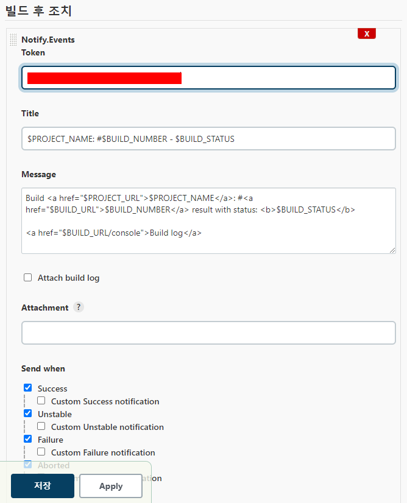
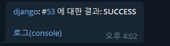

## 0. 서론
현재 `freestyle project` 의 빌드 후 조치 항목에서 `notify.events` 로 알림을 보내고 있다.  



이것과 동일한 알림을 파이프라인에서 보내도록 하기 위해 찾아봤다.

## 1. post 사용하기
아래 예제처럼 `stages` 블록 뒤 `post` 블록을 추가하여 원하는 `step` 이 실행되도록 설정해준다 
```jenkinsfile
pipeline {
    agent any
    tools {
        git "git"
    }
    stages {
        stage('prepare') {
            steps {
                git branch: "ci-cd-settings", url: 'https://github.com/ohyunkyo/inventory-manage-back.git'                
            }
        }
        stage('test') {
            steps {
                sh "pip install -r requirements.txt"
                sh "python3 manage.py makemigrations --settings=config.settings.prod"
                sh "python3 manage.py migrate --settings=config.settings.prod"
                sh "python3 manage.py test --settings=config.settings.prod"
            }
        }
        stage('deploy') {
            steps([$class: 'BapSshPromotionPublisherPlugin']) {
                sshPublisher(
                    continueOnError: false, failOnError: true,
                    publishers: [
                        sshPublisherDesc(
                            configName: "inventory backend",
                            verbose: true,
                            transfers: [
                                sshTransfer(
                                    sourceFiles: "**",
                                    removePrefix: "",
                                    remoteDirectory: "deploys",
                                    execCommand:"cd /home/ec2-user/deploys/; \
                                    sudo docker-compose up -d; "
                                )
                            ]
                        )
                    ]
                )
            }
        }
    }
    post {
        always {
    	    notifyEvents (
    	        token: "notify.event token",
    	        message: "<a href='${env.JOB_URL}'>${env.JOB_NAME}</a>: #<a href='${env.BUILD_URL}'>${env.BUILD_NUMBER}</a> 에 대한 결과: <b>${currentBuild.result}</b><br/><br/><a href='${env.BUILD_URL}console'>console log</a>"
    	    )
        }
    }
}
```

## 2. 빌드 실행 후 알림 확인하기
이제 빌드를 실행하면 모든 `stage` 의 작업이 끝나고 난 후 결과를 텔레그램으로 받을 수 있다.



## 99. 끝나고 나서
각 위치에서 변수를 사용하는 방법이 모두 달랐다.  
`notifyEvents` 스탭에서 사용하는 변수 명에 대한 정보를 찾을수가 없어서 조금 애를 먹었다.   
결국엔 원하는 정보를 얻긴 했지만 전체 변수에 대한 설명이 있는 페이지가 있었으면 좋았을것 같다.(있는데 못찾은걸수도 있음)

## References 
https://medium.com/@gustavo.guss/how-to-do-post-build-in-jenkins-pipeline-d1e7233909b8  
https://www.jenkins.io/doc/pipeline/tour/post/