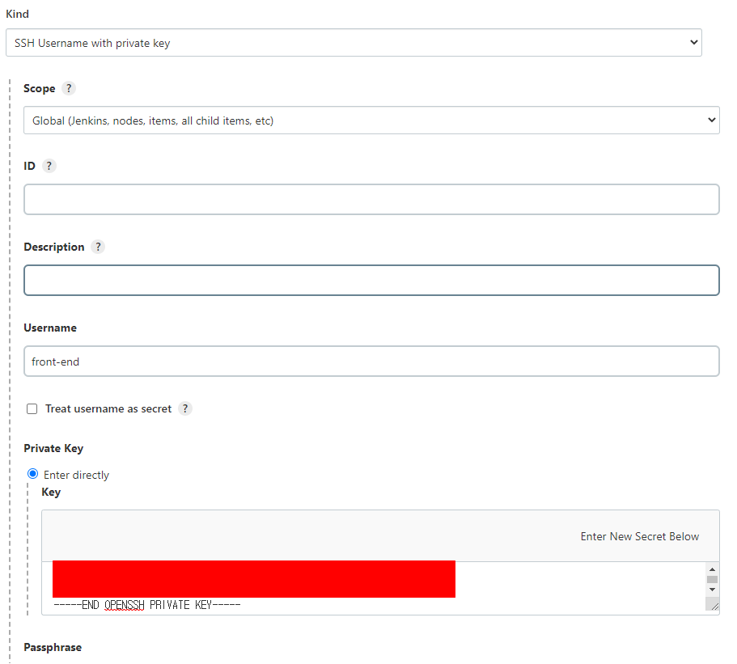
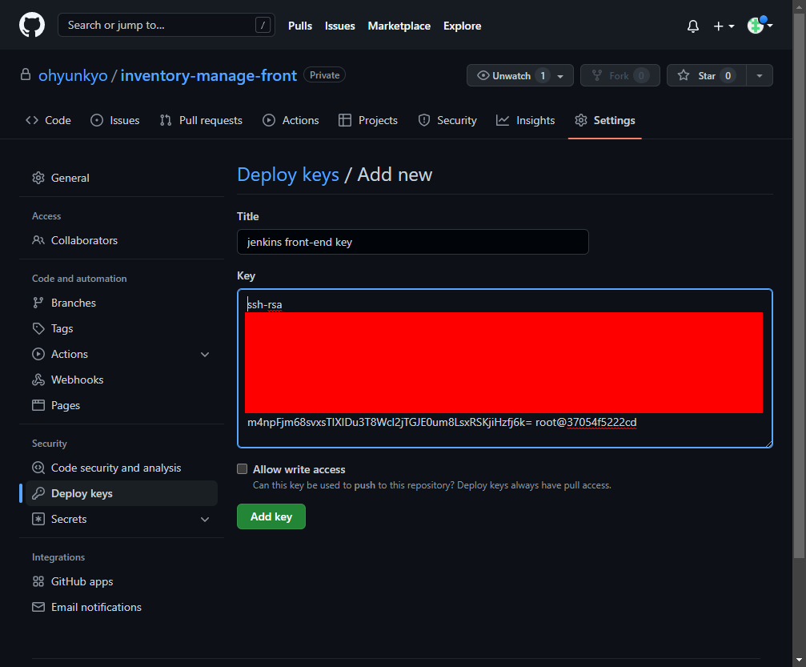
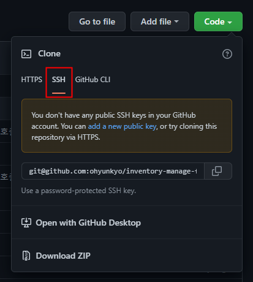
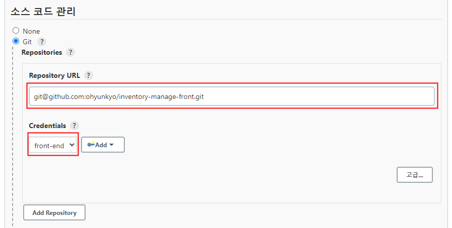

## 0. 서론
프론트엔드 배포를 위해 새로운 Item 을 생성하고 깃허브에서 소스코드를 받아오게 설정할 예정이다.  
그러나 백엔드 저장소와는 달리 vue.js 소스는 비공개이기 때문에 다른 방법을 알아봤다.  

젠킨스 설정에 대한 부분은 생략한다.

## 1. SSH Key 생성
젠킨스 서버의 젠킨스 컨테이너 터미널을 실행한다.
```shell
$ sudo docker exec -it jenkins_cicd /bin/bash
```

이후 젠킨스 홈 디렉토리에 새로운 SSH Key 를 생성해준다.
```
# ssh-keygen -t rsa -f /var/jenkins_home/.ssh/front-end
```

이제 `/var/jenkins_home/.ssh/front-end` 파일(개인키)은 젠킨스에, `/var/jenkins_home/.ssh/front-end.pub` 파일(공개키)은 깃허브 저장소에 등록한다.

## 2. 개인키 등록
`[젠킨스 서버 IP]:8080/credentials/store/system/domain/_/newCredentials` 경로로 들어가서 다음 사진과 같이 선택하고 개인 키를 붙여넣는다.



`username` 이 개인키를 식별하기 위한 구분자 라고 생각하면 된다. 나머지 항목은 공백이여도 무관하다.

## 3. 공개키 등록
`https://github.com/[username]/[reponame]/settings/keys/new` 경로에서 공개 키를 등록한다.



## 4. 저장소 주소 입력하기
젠킨스에서 Job 을 생성하고 해당 저장소의 정보를 입력하기만 하면 끝이다.  
단, 저장소의 주소를 복사할 때 HTTPS 가 아닌 SSH 를 선택해야 한다는것이다.





## References
SSH URL 사용 : https://mingzz1.github.io/development/basic/2021/04/19/jenkins_with_private_repo.html/