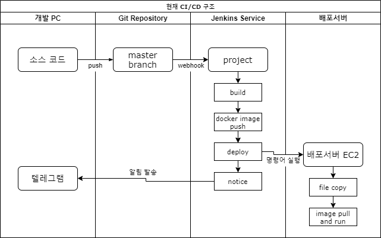
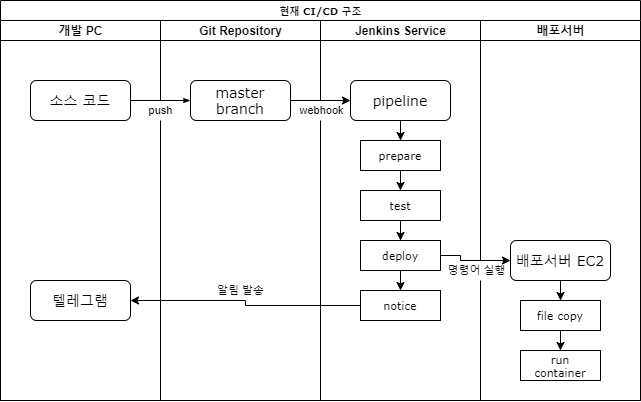

## 0. 서론
`젠킨스를 사용한 장고 배포` 정리 도중 도커 허브에 이미지를 업로드 할 필요성이 없다고 느껴졌다.  
그래서 도커 허브에 이미지를 업로드 하는 과정을 뺀 구조로 변경했다.

## 1. 기존 구조
기존에는 도커 허브에 이미지를 업로드 하고 배포서버에서 그 이미지를 기반으로 컨테이너를 생성했다.

## 2. 현재 구조
어차피 deploy 과정에서 파일을 복사하니, 굳이 도커허브에 이미지를 업로드 하지 않고 복사한 파일로 컨테이너를 실행하도록 변경했다.

