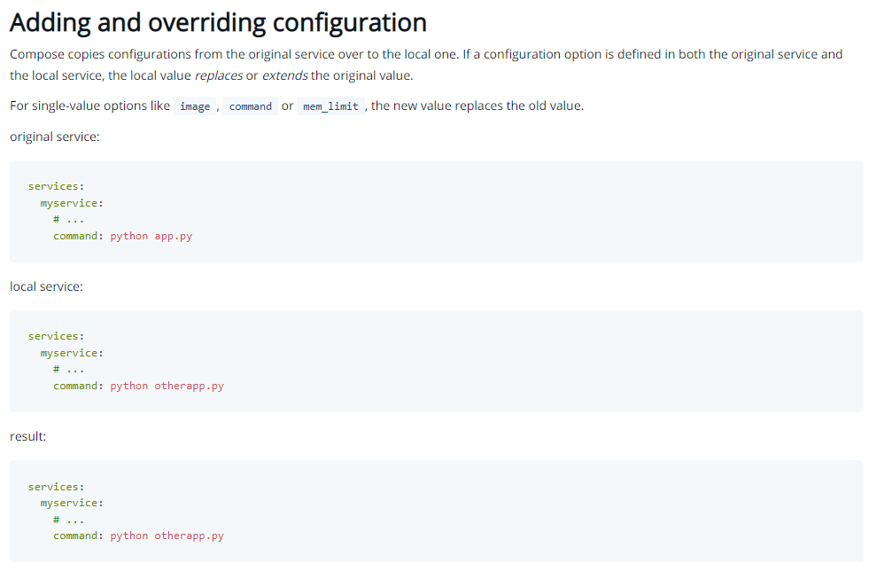
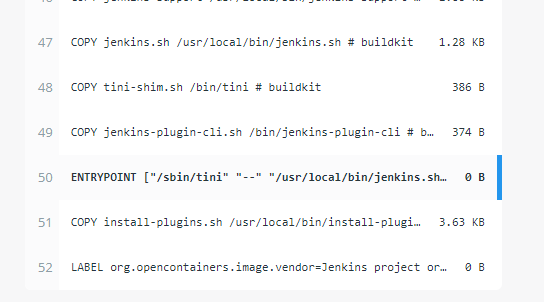
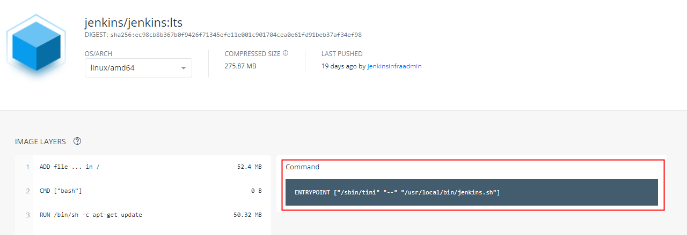

## 0. 서론
도커허브의 젠킨스 이미지를 사용하여 젠킨스 서비스가 포함된 컨테이너를 시작했다.    
그리고 해당 컨테이너의 `bash` 쉘을 실행한 뒤, 각 Job 에서 테스트나 빌드를 위해 필요한 모듈 또는 패키지를 설치하여 사용중이였다.  
이때의 변경사항은 컨테이너에 저장되지 않기 때문에 컨테이너를 재시작 하게 된다면 동일한 작업을 다시 반복해서 해야 하는 문제가 있었다.  
이것을 자동화 하기 위해 컨테이너 생성시 내가 작성한 쉘 스크립트를 실행하도록 하는 방법을 찾아봤다.

## 1. command 설정 추가
`jenkins/jenkins:lts` 이미지에 젠킨스 서비스를 실행하는 명령어가 포함되어 있기 때문에 단순하게 `command` 설정을 추가하여 쉘 스크립트를 실행하기만 하면 내가 생각한 대로 될것 같았다.
```dockerfile
# docker-compose.yml

version: '3'

services:
    jenkins:
        image: jenkins/jenkins:lts
        container_name: jenkins_cicd
        volumes:
            - /var/run/docker.sock:/var/run/docker.sock
            - /home/ec2-user/jenkins_home:/var/jenkins_home
            - /home/ec2-user/jenkins_container_config/django_test_module.sh:/var/jenkins_home/scripts/django_test_module.sh
        ports:
            - "80:8080"
        privileged: true
        user: root
        command: sh -c "/var/jenkins_home/scripts/django_test_module.sh"
```

```shell
# django_test_module.sh

apt-get update -y
apt-get install -y
apt-get install docker.io -y
apt-get install python3 pip -y
pip install django==3.2.6

apt-get install python3-dev default-libmysqlclient-dev build-essential -y
```

## 2. 문제 발생
그러나 내가 생각한대로 작동하지 않았다.  
로그를 확인해 봤을때 스크립트는 잘 실행 되었지만 그 이후 젠킨스 서비스가 실행되지 않고 컨테이너가 종료되었다.  

수행할 프로세스가 없는 이미지의 경우 컨테이너 실행을 완료하면 바로 종료된다고 한다.  
내 예상대로라면 이번에 생성한 컨테이너는 스크립트뿐만 아니라 젠킨스 서비스도 같이 실행하기 때문에 종료되면 안될텐데..     
원인이 무엇일까?

## 3. 원인 파악
아래 사진은 도커 공식 문서의 `docker compose` 부분이다. [링크](https://docs.docker.com/compose/extends/#adding-and-overriding-configuration)  



간략히 요약하자면 내가 `command` 옵션을 설정할 경우 원본의 `command` 옵션을 오버라이딩 한다고 한다.  
그렇기 때문에 나의 스크립트만 실행되고 젠킨스 서비스를 시작하는 명령어는 실행되지 않아 컨테이너가 바로 종료되었던 것이다.

[출처](https://stackoverflow.com/questions/63883149/docker-compose-command-doesnt-override-dockerfile-cmd)

## 4. 문제 해결
나는 이 문제를 해결하기 위해 원본 이미지에서 젠킨스 서비스를 시작하는 부분을 가져와 `docker-compose.yml` 파일에 추가하기로 했다.  
오버라이딩 되어 사라진 명령어를 수동으로 추가하는것이다.  

> 다른 방법으로 해결할 수도 있을것 같다

[도커허브의 이미지](https://hub.docker.com/layers/jenkins/jenkins/jenkins/lts/images/sha256-ec98cb8b367b0f9426f71345efe11e001c901704cea0e61fd91beb37af34ef98?context=explore) (`jenkins/jenkins:lts`) 레이어에서 아래 사진처럼 원하는 부분을 찾아냈다.





그리고 `django_test_module.sh` 와 위의 명령어 모두 실행되도록 변경했다.

```dockerfile
# docker-compose.yml

version: '3'

services:
    jenkins:
        image: jenkins/jenkins:lts
        container_name: jenkins_cicd
        volumes:
            - /var/run/docker.sock:/var/run/docker.sock
            - /home/ec2-user/jenkins_home:/var/jenkins_home
            - /home/ec2-user/jenkins_container_config/django_test_module.sh:/var/jenkins_home/scripts/django_test_module.sh
        ports:
            - "80:8080"
        privileged: true
        user: root
        command: sh -c "/var/jenkins_home/scripts/django_test_module.sh && /sbin/tini -- /usr/local/bin/jenkins.sh"
```

[command 설정에서 여러개의 명령어가 실행되도록 하기](https://binux.tistory.com/76)