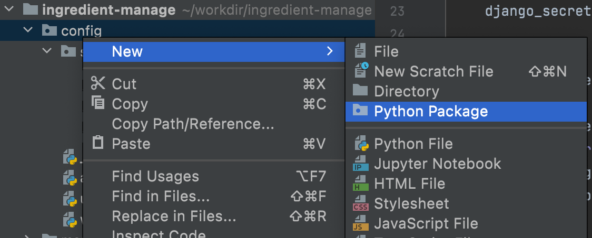
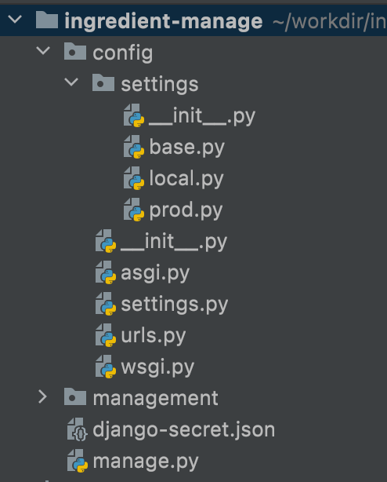
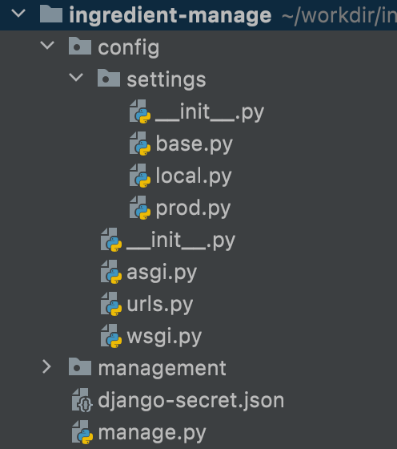
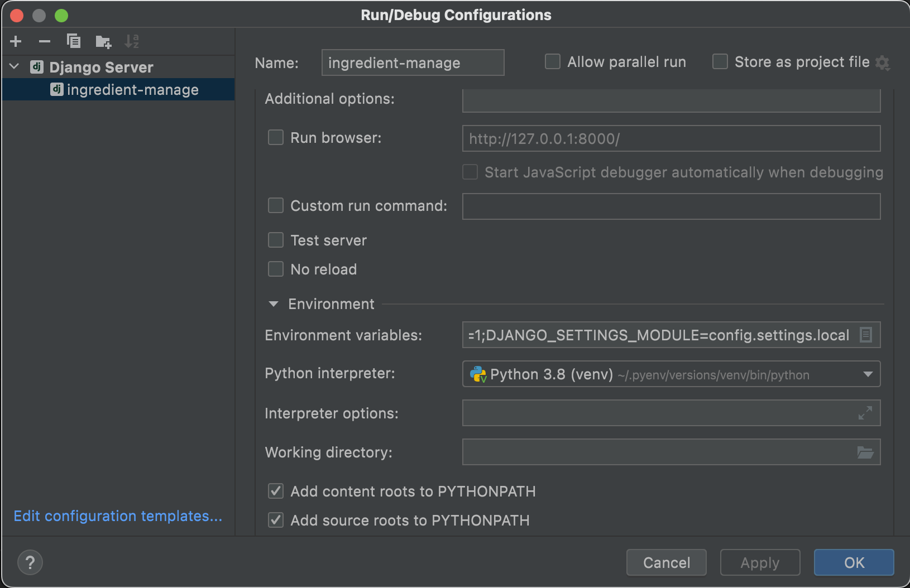
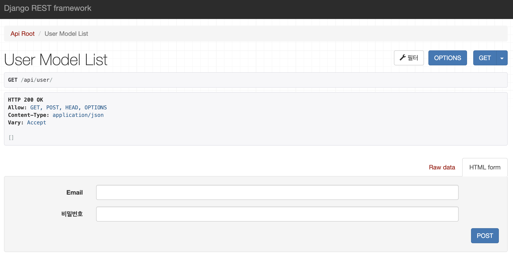

## 0. 서론
장고 프로젝트를 생성하는것부터 간단한 API 를 만드는 과정을 정리한다.

## 1. 장고 프로젝트 생성
프로젝트의 `root` 로 사용될 디렉토리를 먼저 생성하고 그 안에서 프로젝트를 생성 하는 명령어를 실행한다.  
나는 프로젝트 이름을 `config` 로 정했다.

```shell
$ mkdir ingredient-manage
$ cd ingredient-manage 
$ django-admin startproject config .
```

이렇게 하고 나면 다음과 같은 구조의 디렉토리와 파일을 볼 수 있는데, 모든 프로젝트 관련 파일은 `ingredient-manage` 디렉토리에 위치한다. 이후 여기에서 `app` 을 추가하는 방식으로 개발을 진행할것이다.

```
ingredient-manage
├── config
    ├── __init__.py
    ├── asgi.py
    ├── settings.py
    ├── urls.py
    ├── wsgi.py
├── manage.py
```

## 2. IDE 설정
각 IDE 에 맞게 파이썬 인터프리터 및 테스트 환경을 설정해준다.

[Pycharm 설정 방법](/IDE/the-pycharm-i-know/)

## 3. django-rest-framework 설치
drf 를 사용하기 위해 필요한 패키지를 설치한다.

```shell
$ cd ingredient-manage
$ pip install djangorestframework
$ pip install django-filter 
```

## 4. app 생성하기
다음으로 app 을 하나 생성한다.  
각 기능별로 app 을 분리하여 재사용 할 수도 있지만 지금 단계에서는 하나의 app 에 모든 기능을 만들 예정이다.

```shell
$ django-admin startapp management
```

## 5. settings.py 파일 설정하기
### 5.1 INSTALLED_APPS
drf 와 방금 생성한 app 을 사용하기 위해 `INSTALLED_APPS` 에 drf 와 새로 생성한 app 을 추가했다.

```python
INSTALLED_APPS = [
...
    'rest_framework',
    'django_filters',
    'management.apps.ManagementConfig'
```

### 5.2 Internationalization
i18n 설정을 다음과 같이변경한다. 언어 코드와 타임존을 변경했고, DB 에 한국 시간(`KST`)을 저장하기 위해 `USE_TZ` 를 `False` 로 변경했다. 만약 `True` 상태라면 `UTC` 시간이 저장된다.

```python
LANGUAGE_CODE = 'ko-kr'

TIME_ZONE = 'Asia/Seoul'

USE_I18N = True

USE_L10N = True

USE_TZ = False
```

### 5.3 secret 파일
나는 이번 장고 프로젝트를 github 의 public repository 에 업로드 할 예정인데, 이렇게 하면 패스워드나 키가 공개되어 문제가 발생할 수 있다.   
그래서 이런 중요한 정보는 별도로 다른 파일에 보관하고 `settings.py` 에서 그 파일을 불러오도록 할 것이다. 

먼저 `django-secret.json` 이라는 파일을 프로젝트 루트 디렉토리(`ingredient-manage`)에 생성한다. 그 다음 공개하지 않고 싶은 패스워드나 키를 추가한다.
```json
{
  "DJANGO_SECRET_KEY": "",
  "DB_DEFAULT_ENGINE": "",
  "DB_DEFAULT_NAME": "",
  "DB_DEFAULT_USER": "",
  "DB_DEFAULT_PASSWORD": "",
  "DB_DEFAULT_HOST": "",
  "DB_DEFAULT_PORT": "",
  "PROD_ALLOWED_HOSTS": []
}
```

그다음으론 이 파일을 읽은 뒤 적절한 위치에 적절히 호출하면 된다.    
나는 `settings.py` 파일의 `BASE_DIR` 옵션 바로 밑에서 `django-secret.json` 파일을 불러왔다. 
```python
import json
from pathlib import Path

from django.core.exceptions import ImproperlyConfigured

...

BASE_DIR = Path(__file__).resolve().parent.parent

# get secret file
with open('./django-secret.json') as f:
    django_secret = json.loads(f.read())


def get_secret(setting, secrets=django_secret):
    try:
        return secrets[setting]
    except KeyError:
        error_msg = "Set the {0} enviroment varialble".format(setting)
        raise ImproperlyConfigured(error_msg)
        
...
```

그리고 아래처럼 호출했다.

```python
...

SECRET_KEY = get_secret("DJANGO_SECRET_KEY")

...
```

`SECRET_KEY` 뿐 아니라 DB 정보도 같은 방식으로 호출하면 중요한 정보를 노출하지 않을 수 있다.

### 5.4 settings 분리하기
이제 `settings.py` 파일을 분리한다.  개발과 운영 환경을 다르게 유지하기 위한것인데, `DEBUG` 옵션 처럼 각 운영 환경에서 다른 값을 설정해야 하는 경우 필요한 작업이다.

#### 5.4.1 python package 생성



`config` 디렉토리에 `settings` 라는 이름의 `Python Package` 를 생성한 뒤 그 내부에 `base.py`, `local.py`, `prod.py` 파일 세개를 추가한다.  
이때 파일 구조는 아래 사진과 같다.



#### 5.4.2 base.py 설정
다음으로는 `settings.py` 파일의 내용을 모두 복사해 `base.py` 파일에 붙여넣은 뒤 삭제한다.



> `base.py` 파일은 모든 환경에서 공통으로 사용되는 설정을 포함한다.

#### 5.4.3 local.py, prod.py 설정
`local.py` 파일과 `prod.py` 파일은 각각 개발, 운영 환경에서만 필요한 설정을 포함하면 되는데, 나는 아래처럼 설정했다.

```python
# local.py
# 기본 설정 그대로 사용

from .base import *
```

```python
# prod.py
# 운영서버에서는 DEBUG 를 False 로 설정해야 한다

from .base import *

# SECURITY WARNING: don't run with debug turned on in production!
DEBUG = False
```

#### 5.4.4 local.py 를 사용하여 테스트서버 실행하기
방금전에 생성한 `local.py` 를 사용하여 테스트 서버를 실행한다.  
아래 사진처럼 `Environment variables` 옵션에 `DJANGO_SETTINGS_MODULE=config.settings.local` 를 추가해주면 이 설정파일로 테스트 서버가 실행된다.



운영서버를 실행할 때에는 gunicorn 에 `DJANGO_SETTINGS_MODULE=config.settings.prod` 라는 옵션을 추가하면 된다.

## 6. drf 시작하기
커스텀한 `User` 모델을 api 를 통해 조회하는 예제를 만들어봤다. 
### 6.1 /config/urls.py
management app 의 `urls.py` 파일을 불러오는 구문을 추가한다
```python

urlpatterns = [
    path('admin/', admin.site.urls),
    path('', include('management.urls')),
]
```

### 6.2 /management/urls.py<a id='6.2-/management/urls.py'></a>
`rest_framework.routers` 의 `DefaultRouter` 를 사용해 URL 패턴을 정의한다.  
```python
from django.urls import path, include
from rest_framework.routers import DefaultRouter

from .views import api_views

router = DefaultRouter()

router.register(r'user', api_views.UserModelViewSet, basename='user')


urlpatterns = [
    # api
    path('api/', include(router.urls)),
]
```

### 6.3 /management/models.py
장고에서 사용될 모델을 정의한다. 나는 `User` 모델을 커스텀하여 사용하기로 했기 때문에 `User` 클래스를 작성했다.

```python
from django.contrib.auth.base_user import AbstractBaseUser
from django.db import models


class User(AbstractBaseUser):
    username = None
    email = models.EmailField(unique=True)

    USERNAME_FIELD = 'email'
    REQUIRED_FIELDS = []

    class Meta:
        db_table = 'auth_user'
        verbose_name = '사용자'
```

### 6.4 /management/filters.py
drf 의 `filter` 는 API 가 쿼리셋에서 반환하는 항목을 제한 할 수 있다.  
예를들어, 특정 날짜에 가입한 회원만 반환한다던가 몇살 이상 회원만 반환 하도록 할 수 있다.  

지금은 `filter` 의 기능이 필요 없지만 사용가능하도록 간략히 작성했다.
```python
import django_filters
from django_filters import FilterSet

from .models import User


class UserFilter(FilterSet):
	class Meta:
		model = User
		fields = ['email']
```

### 6.5 /management/serializers.py
`serializers` 는 쿼리셋이나 모델 인스턴스를 파이썬 데이터 형태로 변경해준다.  
또한, 모델 인스턴스의 특정 필드만을 반환하거나 데이터 형식(날짜 등)을 변환하여 반환 하도록 할 수 있다.

아래 예제는 `User` 모델에서 `id`, `email`, `password` 필드를 반환하도록 만든 `serializers` 이다.
```python
from rest_framework import serializers

from .models import User


class UserSerializer(serializers.ModelSerializer):
    class Meta:
        model = User
        fields = ['id', 'email', 'password']
```

### 6.6 /management/views/viewsets.py
`viewset` 는 클래스 형태의 뷰이다. `.get()` 이나 `.post()` 같은 메서드 대신에 `.list()` 나 `.create()` 같은 액션을 지원한다.

아래 예제는 지금까지 생성한 `UserFilter`, `User` 모델, `UserSerializer` 를 사용하는 `Viewset` 예제이다.

```python
from django_filters.rest_framework import DjangoFilterBackend
from rest_framework.viewsets import ModelViewSet

from management.filters import UserFilter
from management.models import User
from management.serializers import UserSerializer


class UserModelViewSet(ModelViewSet):
    queryset = User.objects.all()
    filter_backends = [DjangoFilterBackend]
    filterset_class = UserFilter
    serializer_class = UserSerializer
```

## 7. 결과 확인
[6.2](#6.2-/management/urls.py) 에서 등록한 대로 주소창에 입력해보면 아래 사진처럼 API 화면을 확인할 수 있다.
> ex) example.com/api/user/



## References
[1. django 튜토리얼](https://docs.djangoproject.com/ko/4.0/intro/tutorial01/)  
[1. 프로젝트 이름을 config 로 사용한 이유](https://forum.djangoproject.com/t/project-naming-conventions/339/12)  
[6.2 Routers](https://www.django-rest-framework.org/api-guide/routers/)  
[6.4 Filtering](https://www.django-rest-framework.org/api-guide/filtering/)  
[6.5 Serializers](https://www.django-rest-framework.org/api-guide/serializers/)  
[6.6 Viewsets](https://www.django-rest-framework.org/api-guide/viewsets/)  